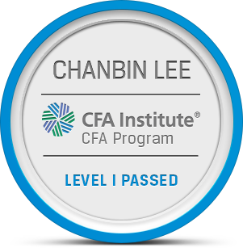
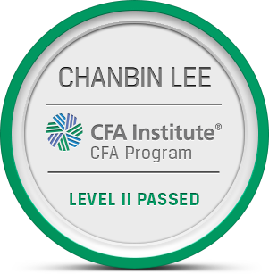

== Education ==

[Graduated Haneul Academy 4th (2014.03 ~ 2017.02)](http://haneul.hs.kr/)

[Graduated Sungkyunkwan University (2017.03 ~ 2023.02)](https://www.skku.edu/skku/index.do)
  - [[Bachelor] Global Business Administration (GBA)](https://globalbiz.skku.edu/gba/index.do)
  - Academic Excellent Scholarship (2017 Spring)
  - Academic Excellent Scholarship (2021 Fall)
  - Course taken
    - Financial Management, Corporate Finance, Investments
    - Behavioral Finance & Fintech, Derivative Securities and Risk Managements
    - International Finance, Current Topics in Finance: Hedge Fund and Data Science
    - Linear Algebra, Quantitative Analysis for Business: Math for Machine Learning
    - Microeconomics, Macroeconomics
    - Financial Accounting, Intermediate Accounting I, Managerial Accounting
  - GPA: 4.01/4.5(Total), 4.1/4.5(Major)

&nbsp;

== Foreign Language ==

[National Certified Chinese Characters Level Tests](https://www.hanja.re.kr/)
  - 韓國語文會 漢字能力檢定試驗 國家公認 3級 (2007) [36-654-0030]
  - 韓國語文會 漢字能力檢定試驗 國家公認 2級 (2010) [47-387-0001]
    - 第 17會 蘭汀奬學生 (2級)

[TOEIC 940 (Oct. 2018) - Expired](https://www.toeic.co.kr/)

&nbsp;

== Certification & Nomination ==

[[네이버 제 10대 파워지식in] (2013)](https://kin.naver.com/profile/index.naver?u=SFYWO6QJg73UnGImd%2Fhl%2F%2Bw7qNk2f9qn6NSbKRv0GN4%3D)

[Passed 14th Teen-Maekyung Test (May. 2015) - Expired](https://exam.mk.co.kr/)

[Passed 32nd MaeKyung Test (Feb. 2016) [MK32-3182897] - Expired](https://exam.mk.co.kr/)

[Passed 33rd TESAT (Mar. 2016) - Expired](http://www.tesat.or.kr/)

[Passed 20th Certified Research Analyst (Jul. 2022) [22-011910]](https://drive.google.com/file/d/1E7aTQQuBXjOr1gv7KxBRDCV7SMxfGomi/view?usp=sharing)

[Passed 14th Certified Financial Risk Manager (Aug. 2022) [22-012065]](https://drive.google.com/file/d/18QRY3EbDB3a8gRdlH5UUO6BovW9WydbA/view?usp=sharing)

[Passed Chartered Financial Analyst Level 3 (Feb. 2024)](https://www.cfainstitute.org/)

&nbsp;

== Project ==

[(Integrative Core) Samsung Electronics Business Analysis Report (2021)](https://drive.google.com/drive/folders/0B7i2r78BHshjflR0WFNvOXNnOWM3MlRRZmhmVVlQNkJ5TkJWTW1oVlZpeWJaS0JNQjNzQmM?resourcekey=0-iznMBn2SYf9lSvjkMm23FQ&usp=sharing)
  - [Presentation](https://www.youtube.com/watch?v=nhrtQ1xjOwE)
  - [Marketing, Operation Managements, Corporate Finance, Strategic Management](https://drive.google.com/drive/folders/0B7i2r78BHshjfjRsSkpEdkgyWC0yLXVvTFBxQWM1OWVOZ0Y3bmlkS2l4RnlMV1htWEZTZ2M?resourcekey=0-I-CjwiyDchHuXneXGO9Nkg&usp=sharing)
  - Won 1st place in Corporate Finance Analysis among 22 groups (Prof. Jong-min Oh)

[(Relative valuation) Kakao Bank Investment Report (2021)](https://drive.google.com/drive/folders/0B7i2r78BHshjfldYQl9jV09mNVdiQTJRV3JpTXFzYTJESTI0Mm1IdnVJLUpnSXV2UWNVREU?resourcekey=0-V4Bq1rRYtFpSiL0v4HTyXQ&usp=sharing)
  - [Presentation](https://www.youtube.com/watch?v=kCV5_G1Vxtc&t=312s) Restoring the link right now :(

[(Hedge Fund Strategy) Value + Quality Factor Portfolio Backtesting & Presentation (R, Rstudio) (2021)](https://drive.google.com/drive/folders/0B7i2r78BHshjfndOak1OVXRBX0V4bG8xNVpLQWU2dDF6djUtS1hKRTlMQ21lQmJQd1JYMWc?resourcekey=0-wq2s1mys9PaUGKGMSCXR-w&usp=sharing)
  - Factor: NCAV/BV, Net-Ic/BV, GPA/BV (5, 10, 20, 70 years backtesting)

[(DB GAPS 2022) Constructing Portfolio (2022)](https://gaps.dbfoundation.or.kr/)
  - [Team Name: 닥트리오](https://drive.google.com/drive/folders/0B7i2r78BHshjfjlSa2xmbGlRYWgyc0hUQk1GTFQwUVRveF9uaE5SOXhRTzdxcUxmMTZmM00?resourcekey=0-TmqcwjYabwtpQhbKHJxJyQ&usp=sharing)
  - Used R, Rstudio
  - [Submissions](https://drive.google.com/drive/folders/1l6eGFZyyCdr-Jjp4fyZoJOO7CRs3TZ0X?usp=sharing)
  - [Preliminary contest ranking: 106/659 (top 15.25%) → Became Finalists (Top 104 team)](https://gaps.dbfoundation.or.kr/Community/NoticeView?idx=1895)
  - Final contest ranking: 24/95 → Participated in Final Presentation [(Youtube Live Broadcast)](https://youtu.be/PrQhydbzpfg)

[(RootN S&P SKKU Quant Strategy) Constructing Portfolio (2022)](https://drive.google.com/drive/folders/0B7i2r78BHshjfjBZNV9weDdXUDRldzNCZHR1eGhDcnUwVW1heGpZLVFiaWtRQVFXdmkwVnM?resourcekey=0-F2rGu7YjTQ8ADZf2YuiH6A&usp=sharing)
  - [Team Name: Zeta_phi](https://drive.google.com/file/d/1Us-HICuVLJ0j48oe7A-iNT1JlJQ0lAwV/view?usp=sharing)
  - Used R, Rstudio
  - [Submissions](https://drive.google.com/drive/folders/0B7i2r78BHshjfld3M09vTWlpeHhMYm80XzRhRlBjbDl1czZFUFFDY3VRRGJIdWItczg3RnM?resourcekey=0-zPX-zJWolUeE2XC9S2DLRw&usp=sharing)
  - Participated in preliminary contest

[(FSI Data Challenge 2022) Segmentizing the customer and constucting portfolios using bigdata (2022)](https://www.datachallenge2022.com/)
  - [Team Name: DTD](https://drive.google.com/file/d/183B1wis0wV5HwyMHCZ25LuNi0Lv057cp/view?usp=sharing)
  - Used R, Rstudio
  - [Submissions](https://drive.google.com/drive/folders/0B7i2r78BHshjflNSRV9ocXZsSklqb3c1UmROX21ibDNuaGJ1MmlsZEN0ZlpIMUlhdWFHVFk?resourcekey=0-hvtU6xfvBcEathTJoNHPsQ&usp=sharing)
  - Passed a preliminary and fianl contest → Became Finalists
  - Participated in Final Presentation

&nbsp;

== Volunteering == (115 hours in total (2017-2022))

[Translator of Special Olympics Abu dahbi 2019 (2019)](https://www.abudhabi2019.org/)
  - Voluenteered for translating the guidelines of each sport manual for athletes and coaches

Education voluenteer for middle school and high school students [네이버 지식in] (2019)

[Served Military Service at Republic of Korean Army (Apr. 2019 - Nov. 2020)](https://ko.wikipedia.org/wiki/%EC%88%98%EB%8F%84%EA%B8%B0%EA%B3%84%ED%99%94%EB%B3%B4%EB%B3%91%EC%82%AC%EB%8B%A8)
  - The Capital Mechanized Infantry Devision, The 1st Mechanized Infantry Brigade

&nbsp;

== Now Studying ==

[R(Rstudio)](https://www.rstudio.com/) → Major language used

[Python(Anaconda, Jupyter)](https://www.python.org/)
